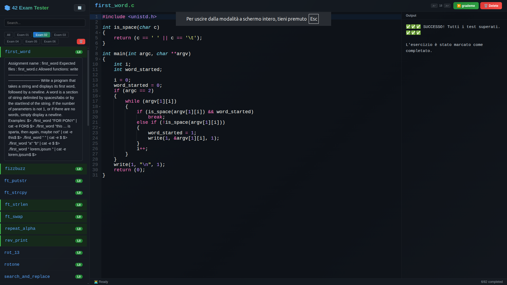

# 42 Exam Tester

A web IDE to practice for **42 exams**, directly from your browser.

## ✨ Features

- **Ace Editor** (the same as onlineGDB) with C syntax highlighting
- **Smart Autocompletion** — local variables (highest priority) + C keywords + symbols from `#include`d libraries (parsed from your code)
- **Highlight occurrences** — click on a variable/function and see all matches
- **Smart auto-indentation** for C (real tabs)
- **Run Code** (Ctrl+R) — compile & run your code instantly with custom arguments, useful for debugging
- **Grademe** (Ctrl+G) — automated tests with error tracing
- **Custom compile/run command** — edit the command bar below the editor to pass arguments like `./alpha_mirror "test"`
- **Resizable output panel** — drag to resize, toggle with 🖥️ button
- **Output shows `$`** when no output produced, normal newlines otherwise
- **Auto-save** every 30 seconds
- **Progress tracking** — completed/failed exercises persist in localStorage
- **Exam filters** (Exam 02, Exam 03, ...)
- **Color badges** for levels (0-3) and ⚠️ for incomplete exercises
- **Zoom** (A+ / A− buttons)
- **Dark Dracula theme**



## 🚀 Installation

```bash
git clone https://github.com/gabrielerellini/42-Exam-Tester.git
cd 42-Exam-Tester
npm install
npm start
```

Open your browser at **http://localhost:4242**

To stop the server: press `Ctrl+C` in the terminal.

## 🎮 How to use

1. Select an exercise from the left sidebar
2. Read the subject (click on the exercise name to expand)
3. Write your code in the editor
4. Press **▶️ Run Code** (Ctrl+R) to compile & run your code
5. Press **📝 grademe** (Ctrl+G) to run the official tests
6. If it passes, the exercise is marked as completed ✅

### Shortcuts

| Key | Action |
|---|---|
| Ctrl+R | Run code with custom args |
| Ctrl+G | Grading (run official tests) |
| Ctrl+S | Save code |

## 🧩 Project structure

```
42-Exam-Tester/
├── .subjects/           # Exercises (subject, tester, reference solution)
│   ├── STUD_PART/       # Student exams
│   └── PISCINE_PART/    # Piscine exams
├── .system/             # Grading system (compilation, tests)
├── index.html           # Frontend (Ace Editor + UI)
├── server.js            # Backend (Express)
├── package.json         # Dependencies
└── README.md            # This file
```

## 🏷️ Badge reference

| Badge | Meaning |
|---|---|
| L0 green | Level 0 — Easy |
| L1 blue | Level 1 — Medium |
| L2 yellow | Level 2 — Hard |
| L3 red | Level 3 — Very hard |
| ⚠️ gray | Incomplete (missing subject or tester) |

## 🤝 Contributing

Do you have a subject or a tester for an incomplete exercise? Open a PR or report it!

1. Find the exercise in `.subjects/STUD_PART/exam_N/NAME/`
2. If subject is missing, create `attachment/subject.en.txt`
3. If tester is missing, create `tester.sh`
4. Submit a PR!

## 📜 Credits

- **JCluzet** — Creator of the original grading system and testers ([42_EXAM](https://github.com/JCluzet/42_EXAM))
- **gabrielerellini** — Web IDE adaptation (Ace Editor, frontend, optimizations)
- **OnlineGDB** — Inspiration for the Ace editor behavior
